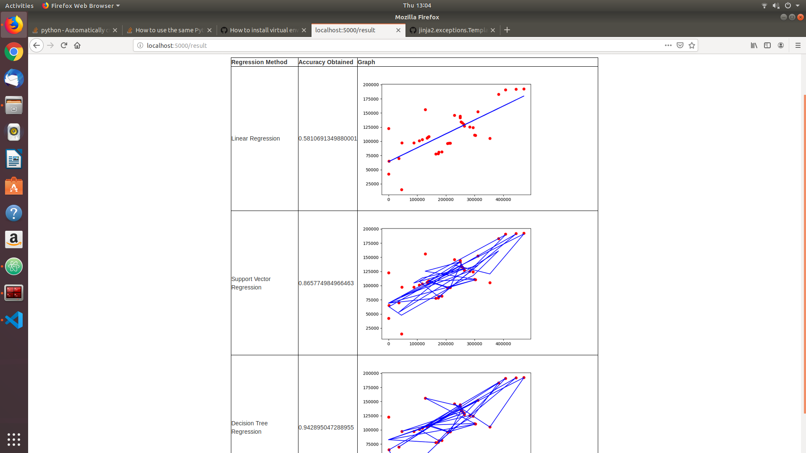
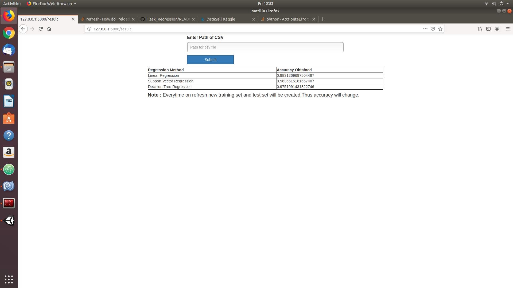

# Regression in Flask
Applying `linear regression`,`random forest` and `decision tree` regression on the csv and displaying which one is the best based on the accuracy and graph.`Flask` is used to do this.

## Developers Guideline
Type the following command based on your system to create the virtual enviornment in python.

```bash

#installing virutal environment

#for ubantu
python3 -m pip install --user virtualenv
#for windows
py -m pip install --user virtualenv

#creating instance of virtualenv
virtualenv venv

#activate virtualenv ubantu
source venv/bin/activate

#activate virtualenv ubantu
venv\Scripts\activate

#add the requirements
pip install -r requirements.txt

#running the project
python app.py

#or
flask run
```

## Results
For `single` attribute the following result is shown



For `multiple` attributes the following result is shown




